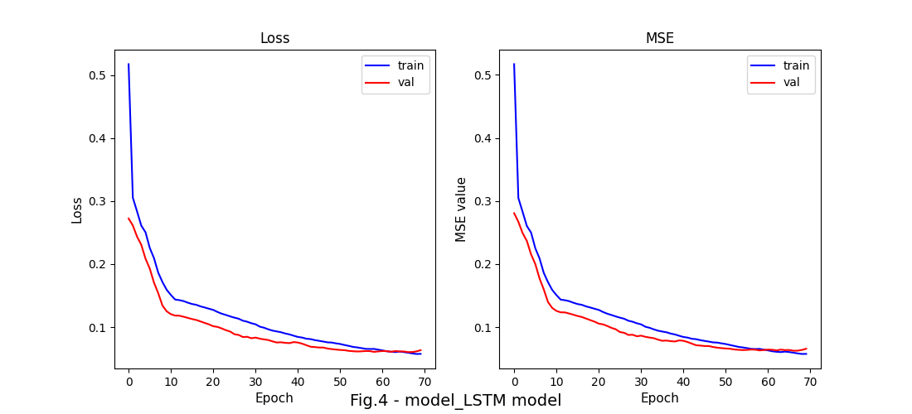
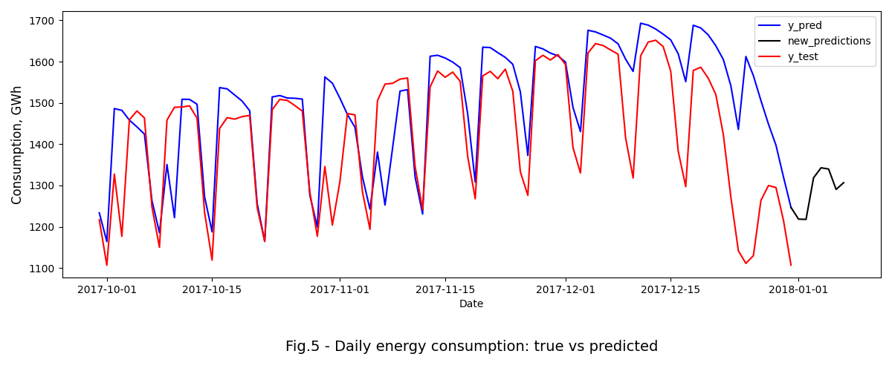

# Power_consumption_prediction

## Content

* [Summary](README.md#Summary)  
* [Project description](README.md#Project-description)  
* [Data and methods](README.md#Data-and-methods)
  * [Current credit risk policy](README.md#Current-credit-risk-policy)   
  * [Features analysis](README.md#Features-analysis)
* [ML model](README.md#ML-model)
* [Results](README.md#Results)      
* [Project structure](README.md#Project-structure)

---
## Summary

It was developed a new model of daily energy consumption from renewables in Germany. The predicting algoritm uses a machine learning model from Tensorflow library.

## Project description

National government and energy companies are interested in forecasting future energy consumption to prevent power outages and create new power facilities. Their power development strategies typically requires accurate modelling of the data to plan future investments.

The power consumption has several remarkable periods of change: weekly and monthly as shown on the fig.2. Unfortunately, simple models like linear regression or decision trees cannot learn seasonal changes and, therefore, should not be applied. On the other hand, neural networks and autoregressive models spot seasonal data much better.

<table class="figures" align="center">
    <td>  </td>
    <td>  </td>
</table>

## Data and methods

The renewable energy generation datataset in Germany between the years 2006–2017 was acquired form [the Open Power System Data (OPSD)](https://open-power-system-data.org/) storage; it was partly described in a [popular tutorial](https://www.dataquest.io/blog/tutorial-time-series-analysis-with-pandas). To increase the accuracy of prediction, the energy consumprion vector (N=4383) was transformed to a two-dimensional array of a shape 4383 rows by 7 columns. Each row represents daily consumption of the electricity plus that in the next 6 days. The goal is to predict the consumption beyond the given timeframe. 

The data was split by 3 samples without shuffling data entries: Train, validation, and test. The last set contained 100 values.

## ML model

Based on author's experience, the model has following architecture: 256 hidden layers of the Long-Short Term Memory (LSTM) with the linear activation function. 

<div align="center">  </div>

After 75 epochs, the model satisfactory predicts consumption with the mean squared error reached 4220 (fig.4).

<div align="center">  </div>


## Results

Although the model 

<div align="center">  </div>

## Project structure

<details>
  <summary>display project structure </summary>

```Python
├── config                      # configuration settings
│   └── config.json              
├── data                        # data archive
│   └── energy_demand_OPSD.zip   
├── figures
│   ├── fig_1.png
.....
│   └── fig_4.png
├── models                      # models and weights
│   ├── linear_model.hdf5
│   ├── model_LSTM.hdf5
│   └── scaler.gz
├── notebooks                   # notebooks
│   └── power_consumption.ipynb
├── README.md
├── requirements.txt
├── utils                       # functions and data loaders
│   ├── config_reader.py
│   ├── functions.py
│   ├── inference.py
│   ├── models.py
│   └── __pycache__
├── .git
└── .gitignore

```
</details>
